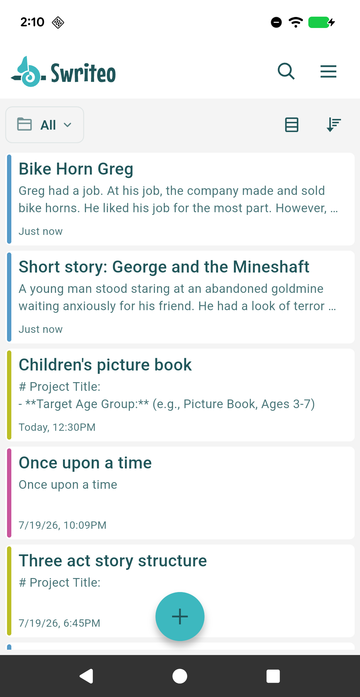

.. Swriteo documentation master file, created by
   sphinx-quickstart on Wed Oct  2 23:51:05 2024.
   You can adapt this file completely to your liking, but it should at least
   contain the root `toctree` directive.

Swriteo
=======

Swriteo is a writing and notes app for Android + Web.

Currently, Swriteo runs on mobile phones and tablets running Android 7+ and is available for download from the Google Play store. There is also a web companion version that runs in modern browsers. Wherever there is a feature that is Android-only, it will be noted in this guide.

For support or feature requests please email hi@swriteo.com.

.. note::
   This user guide is still being written. In the meantime, you can feel free to ask me (the developer) questions directly via the email above. :)

.. note::
   This guide always reflects the very latest version of Swriteo. Sometimes, it may contain content or references to features for the next version that are not yet publicly available.

.. toctree::
   :maxdepth: 2
   :caption: Contents:

